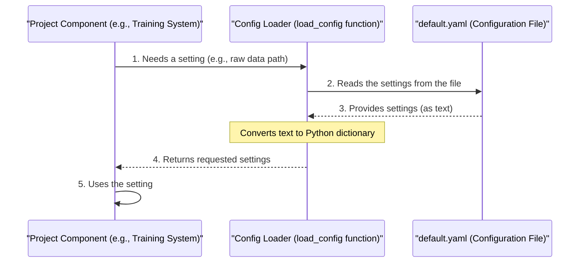

# 🚗 Vehicle Price Prediction App

This project is a **machine learning web application** that predicts the price of a used vehicle based on inputs like **Make**, **Model**, **Year**, and **Mileage**.

Built with **scikit-learn** for modeling and **Streamlit** for an interactive frontend, it's deployed on **Render** for easy access.

---

## 📌 Features

- ML-based prediction using `RandomForestRegressor`
- Interactive web UI using Streamlit
- Dropdowns for **Make** and **filtered Model**
- Simple input form for:
  - Year
  - Mileage
  - Make
  - Model
- Fast price prediction in ₹

---

## 🧠 Tech Stack

| Layer        | Technology              |
|--------------|--------------------------|
| Frontend     | Streamlit               |
| ML Model     | scikit-learn            |
| Language     | Python 3.13             |
| Deployment   | Render                  |
| Dataset      | CSV (Custom vehicle data) |

---

## 🗂️ Folder Structure

```
vehicle-price-prediction/
│
├── app.py                    # Streamlit app
├── models/                   # Trained model file
│   └── latest_model.joblib
├── requirements.txt
├── README.md
├── src/
│   ├── config/
│   │   ├── config.py
│   │   └── default.yaml
│   ├── data/
│   │   └── raw/
│   │       └── dataset.csv
│   └── vehicle_price/
│       ├── __init__.py
│       ├── train.py
│       └── features.py
```

---

## 🧪 Run Locally

### 📋 Prerequisites

- Python 3.13+
- pip

### 🔧 Installation

```bash
git clone https://github.com/abhishek-si-ngh/vehicle-price-prediction.git
cd vehicle-price-prediction
python -m venv .venv
.venv\Scripts\activate  # For Windows
pip install -r requirements.txt
```

---

### 🏋️‍♂️ (Optional) Train the Model

```bash
set PYTHONPATH=src
python -m vehicle_price.train
```

---

### 🚀 Launch the App

```bash
streamlit run app.py
```

Then go to [http://localhost:8501](http://localhost:8501)

---

## 🌐 Live Demo

🔗 **Deployed on Render**: [https://vehicle-price-prediction-6nxr.onrender.com](https://vehicle-price-prediction-6nxr.onrender.com)


---


## 🤝 Contributing

Feel free to fork the repo, create a branch, and submit a pull request.

---

## 📄 License

MIT License © [Abhishek Singh](https://github.com/abhishek-si-ngh)
# Chapter 7: Project Configuration

In our journey through the `vehicle-price-prediction` project, we've explored many important parts. We saw how the [Raw Data Management](06_raw_data_management.md) system loads our original `dataset.csv` file. You might have noticed a special line in `src/data/data.py` that looked like this: `cfg = load_config()` and `cfg["paths"]["raw_data"]`.

This `cfg` thing is exactly what **Project Configuration** is all about!

### What Problem Does It Solve?

Imagine our entire project is like building a complex LEGO castle. You have different people working on different parts: one person builds the towers, another works on the walls, and someone else designs the drawbridge.

Now, what if the instructions for where to find the "red bricks" are written differently on each person's blueprint? Or if the total number of "blue flags" needed is just remembered by one person, and others don't know? This would lead to chaos, mistakes, and lots of wasted time!

The **Project Configuration** solves this by acting like the **master blueprint or the project's central instruction manual**. It's a single, organized place where *all* the important shared information and settings for our entire project are written down.

This includes things like:

*   **File Locations**: Where is the raw data file? Where should the trained model be saved?
*   **Feature Names**: Which columns in our data are numbers (like `year`, `mileage`)? Which are text categories (like `make`, `model`)?
*   **Training Parameters**: How much data should be used for testing during training? (Like `test_size: 0.2`).

By having one central "book of rules," every part of our code can look up the same consistent settings. This makes our project much more:

1.  **Organized**: Everything is in one place.
2.  **Consistent**: All parts of the code use the same paths and settings.
3.  **Easier to Change**: If we move a file, or want to use a different set of features, we only change it in *one* place (the configuration file) instead of searching through many different code files. This is like updating one master blueprint instead of many individual ones.

### How to Use Our Project Configuration

You don't "run" the Project Configuration by itself. Instead, it's designed to be *read* by all the other parts of our project when they need to know a specific setting. Think of it as a reference book that everyone consults.

Let's see a simple example of how a part of our code would load and use a setting from the configuration.

First, ensure you've set up the project (from [Chapter 1](01_interactive_web_application_.md)):

```bash
git clone https://github.com/abhishek-si-ngh/vehicle-price-prediction.git
cd vehicle-price-prediction
python -m venv .venv
.venv\Scripts\activate  # For Windows users. Use 'source .venv/bin/activate' for macOS/Linux
pip install -r requirements.txt
```

Now, let's create a tiny Python file called `check_config.py` in the root of your project folder (next to `app.py`) and put the following code inside it:

```python
# File: check_config.py
import sys
# Add 'src' directory to Python's search path
sys.path.append('src')

from config.config import load_config # Import our configuration loader

print("Loading project configuration...")
cfg = load_config() # This loads all settings into 'cfg'

# Now we can access specific settings, like the raw data path
raw_data_path = cfg["paths"]["raw_data"]
print(f"Raw data path from config: {raw_data_path}")

# Or the list of numeric features
numeric_features = cfg["numeric_features"]
print(f"Numeric features from config: {numeric_features}")

# Or the test size for data splitting
test_size = cfg["split"]["test_size"]
print(f"Test size from config: {test_size}")
```

To run this script, you just need Python:

```bash
python check_config.py
```

When you run it, you'll see output similar to this:

```
Loading project configuration...
Raw data path from config: src/data/raw/dataset.csv
Numeric features from config: ['year', 'mileage']
Test size from config: 0.2
```

This simple script shows how easy it is for any part of our project to "ask" the configuration for important settings, rather than having those settings hardcoded everywhere.

### What Happens "Under the Hood"?

Our Project Configuration relies on two main parts:

1.  **The Configuration File**: A simple text file (`default.yaml`) that stores all the settings in an easy-to-read format.
2.  **The Loader Function**: A small Python function (`load_config()`) that knows how to read this text file and turn it into something Python can understand (a dictionary).



Let's look at the `src/config/default.yaml` file, which is our actual "master blueprint" for settings.

#### 1. The `default.yaml` File: Our Master Blueprint

This file uses a format called **YAML** (which stands for "YAML Ain't Markup Language"). It's very simple and uses indentation (spaces) to show how things are grouped.

```yaml
# File: src/config/default.yaml
paths: # This is a section for all file paths
  raw_data: src/data/raw/dataset.csv # Path to our raw data file
  model_file: models/latest_model.joblib # Path to save/load our trained model

target: price # This is the name of the column we want to predict (the vehicle price)

numeric_features: # These are columns with numbers
  - year
  - mileage

categorical_features: # These are columns with text categories
  - make
  - model

split: # Settings for splitting our data into training/testing parts
  test_size: 0.2 # 20% of data will be used for testing
  random_state: 42 # Ensures we get the same data split every time for consistency
```

Let's break down each section:

*   **`paths`**: This section lists important file locations.
    *   `raw_data`: Points to where our original vehicle data is stored. ([Raw Data Management](06_raw_data_management.md) uses this!)
    *   `model_file`: Points to where our trained machine learning model will be saved and loaded from. ([Prediction Engine](03_prediction_engine.md) and [Model Training System](04_model_training_system_.md) use this!)
*   **`target`**: This is simply the name of the column in our data that we are trying to predict (in our case, the `price`). ([Model Training System](04_model_training_system_.md) uses this!)
*   **`numeric_features`**: This lists all the columns in our data that contain numbers and where direct mathematical operations make sense (like `year`, `mileage`). ([Data Transformation Pipeline](05_data_transformation_pipeline_.md) and [Model Training System](04_model_training_system_.md) use this!)
*   **`categorical_features`**: This lists columns that contain text categories (like `make`, `model`). These need special handling by the [Data Transformation Pipeline](05_data_transformation_pipeline_.md) to convert them into numbers.
*   **`split`**: These settings are used when we divide our data into training and testing sets for the [Model Training System](04_model_training_system_.md).
    *   `test_size`: How much of the data to keep aside for testing (here, 0.2 means 20%).
    *   `random_state`: A number that ensures that every time we split the data, we get the exact same groups, which is important for consistent experiments.

#### 2. The `load_config()` Function: The Reader

Now, let's look at the simple Python code that reads this YAML file. It's located in `src/config/config.py`:

```python
# File: src/config/config.py
import yaml # This library helps us read YAML files

def load_config(path="src/config/default.yaml"):
    # Open the file specified by 'path' in read mode ("r")
    with open(path, "r") as f:
        # Use yaml.safe_load() to read the file and turn it into a Python dictionary
        return yaml.safe_load(f)
```

*   `import yaml`: This line brings in the `PyYAML` library, which is a tool specifically designed to work with YAML files.
*   `def load_config(path="src/config/default.yaml"):`: This defines our function. By default, it looks for the `default.yaml` file in the `src/config/` folder.
*   `with open(path, "r") as f:`: This opens the `default.yaml` file for reading. The `with` statement ensures the file is properly closed afterwards.
*   `return yaml.safe_load(f)`: This is the magic line! `yaml.safe_load()` reads the content of our `default.yaml` file and automatically converts all the sections and values (like `paths`, `raw_data`, `test_size`, etc.) into a regular Python dictionary. This dictionary is then returned, allowing any part of our code to easily access settings like `cfg["paths"]["raw_data"]`.

#### How Other Parts Use It (Examples from Previous Chapters)

You've already seen `load_config()` in action in many places!

**In the [Raw Data Management](06_raw_data_management.md) (`src/data/data.py`):**

```python
# File: src/data/data.py (snippet)
from config.config import load_config # Used to load config!

def load_raw_data():
    cfg = load_config() # Loads the entire config dictionary
    return pd.read_csv(cfg["paths"]["raw_data"]) # Uses the raw_data path from config
```
Here, `load_raw_data()` asks the configuration for the correct path to the `dataset.csv` file.

**In the [Data Transformation Pipeline](05_data_transformation_pipeline_.md) (`src/vehicle_price/features.py`):**

```python
# File: src/vehicle_price/features.py (snippet)
from config.config import load_config # Used to load config!

def split_data(df):
    cfg = load_config() # Loads the config
    return train_test_split(
        df,
        test_size=cfg["split"]["test_size"], # Uses test_size from config
        random_state=cfg["split"]["random_state"] # Uses random_state from config
    )
# ... other functions in features.py also use cfg for numeric/categorical_features
```
The `split_data()` function relies on the configuration to know how big the test set should be and to ensure a consistent random split. `build_preprocessor()` also uses the `numeric_features` and `categorical_features` lists from the config.

**In the [Model Training System](04_model_training_system_.md) (`src/vehicle_price/train.py`):**

```python
# File: src/vehicle_price/train.py (snippet)
from config.config import load_config # Used to load config!

def train_main():
    cfg = load_config() # Loads the config
    # ...
    # Uses cfg["target"] to know which column is price
    # Uses cfg["paths"]["model_file"] to know where to save the model
    # Uses cfg["numeric_features"] and cfg["categorical_features"] for X_train/X_test
    # ...
```
The `train.py` script is a heavy user of the configuration, using it to define the target variable, find feature names, and determine where to save the trained model.

**In the [Prediction Engine](03_prediction_engine.md) (`src/vehicle_price/predict.py`):**

```python
# File: src/vehicle_price/predict.py (snippet)
from config.config import load_config # Used to load config!

def predict_main():
    cfg = load_config() # Loads the config
    # ...
    model = joblib.load(cfg["paths"]["model_file"]) # Uses the model_file path from config
    # ...
```
The Prediction Engine knows exactly which file to load its "brain" from, thanks to the configuration.

As you can see, the **Project Configuration** is the silent hero working behind the scenes, providing essential, consistent settings to almost every major component of our `vehicle-price-prediction` project.

### Conclusion

In this final chapter, we've uncovered the **Project Configuration**, the central "master blueprint" that keeps our entire `vehicle-price-prediction` project organized and consistent. We learned that it stores all critical settings, like file paths, feature names, and training parameters, in an easy-to-read `default.yaml` file. We also explored how a simple `load_config()` function reads these settings, making them available to all other components, ensuring they all follow the same rules.

You now have a complete understanding of how our vehicle price prediction project is structured, from the user-friendly web application to the foundational raw data management and project configuration. This modular design makes the project easier to understand, maintain, and expand in the future!

---

<sub><sup>Generated by [AI Codebase Knowledge Builder](https://github.com/The-Pocket/Tutorial-Codebase-Knowledge).</sup></sub> <sub><sup>**References**: [[1]](https://github.com/abhishek-si-ngh/vehicle-price-prediction/blob/c51c6beecab8ed18267ef7fd21e5cf1a6d717754/app.py), [[2]](https://github.com/abhishek-si-ngh/vehicle-price-prediction/blob/c51c6beecab8ed18267ef7fd21e5cf1a6d717754/src/config/config.py), [[3]](https://github.com/abhishek-si-ngh/vehicle-price-prediction/blob/c51c6beecab8ed18267ef7fd21e5cf1a6d717754/src/config/default.yaml), [[4]](https://github.com/abhishek-si-ngh/vehicle-price-prediction/blob/c51c6beecab8ed18267ef7fd21e5cf1a6d717754/src/data/data.py), [[5]](https://github.com/abhishek-si-ngh/vehicle-price-prediction/blob/c51c6beecab8ed18267ef7fd21e5cf1a6d717754/src/vehicle_price/features.py), [[6]](https://github.com/abhishek-si-ngh/vehicle-price-prediction/blob/c51c6beecab8ed18267ef7fd21e5cf1a6d717754/src/vehicle_price/predict.py), [[7]](https://github.com/abhishek-si-ngh/vehicle-price-prediction/blob/c51c6beecab8ed18267ef7fd21e5cf1a6d717754/src/vehicle_price/train.py)</sup></sub>